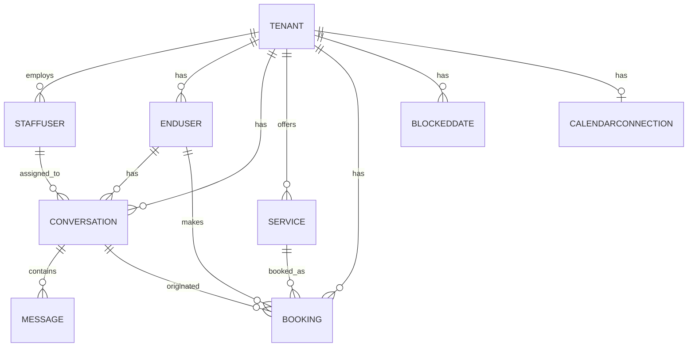

# wa-booking-agent

A multi-tenant WhatsApp booking agent, built on Django.

## Local setup

Requires Docker and Docker Compose.

1. Copy the example environment file and fill in real values (the
   defaults work fine for local dev as-is):

   ```sh
   cp .env.example .env
   ```

2. Bring up the stack:

   ```sh
   make up
   ```

   This starts three services in the background: `app` (Django dev
   server on `localhost:8000`), `db` (Postgres 18 on `localhost:5432`),
   and `redis` (Redis 7 on `localhost:6379`). `docker-compose.override.yml`
   is picked up automatically and gives the `app` container hot reload
   via a bind mount of the repo.

3. Apply migrations:

   ```sh
   make migrate
   ```

4. Confirm everything is wired up:

   ```sh
   make health
   ```

   should return `{"database": "ok", "redis": "ok"}` with a 200 status.

5. (Optional) Get some data to look at:

   ```sh
   docker compose exec app python manage.py seed_demo_data
   ```

   Creates a demo tenant ("Demo Clinic") with two staff logins -
   `platform_admin` and `demo_owner`, both with password
   `demo-pass-1234` - plus a couple of demo services. Safe to run more
   than once (idempotent). Log in at `localhost:8000/login/` with
   either account; `demo_owner` only sees Demo Clinic's data,
   `platform_admin` sees every tenant's.

   To get into `/admin/` instead, create a real superuser:

   ```sh
   docker compose exec app python manage.py createsuperuser
   ```

Run `make help` to see every available target, including `down` and
`shell`.

## Running tests and linters

```sh
make test
make lint
make format-check
```

## Pre-commit hooks

Install once per clone (needs a local Python virtualenv with
`requirements/dev.txt` installed, since pre-commit runs on the host,
not in the container):

```sh
make precommit-install
```

From then on, ruff and black run automatically on every commit. Run
`make precommit-run` to run all hooks against the whole repo on demand.

## Repository structure

Five Django apps, each owning one slice of the domain (every app also
has the standard `apps.py`, `migrations/`, and `tests.py`/`tests/` -
omitted below for brevity):

```
wa-booking-agent/
├── config/                          # Django project package
│   ├── settings/
│   │   ├── base.py                  # shared settings, reads env via django-environ
│   │   ├── dev.py                   # DEBUG=True
│   │   └── prod.py                  # secure cookies, HSTS, SSL redirect, ...
│   ├── urls.py                      # root URLconf
│   ├── wsgi.py / asgi.py
├── core/                            # cross-cutting: health check, auth views, shared mixins
│   ├── mixins.py                    # TenantScopedMixin
│   ├── urls.py                      # /health/, /login/, /logout/
│   └── templates/registration/login.html
├── tenants/                         # Tenant + StaffUser (the custom AUTH_USER_MODEL)
│   ├── models.py
│   ├── admin.py
│   └── management/commands/seed_demo_data.py
├── conversations/                   # EndUser, Conversation, Message + staff dashboard placeholder
│   ├── models.py
│   ├── views.py                     # ConversationListView (tenant-scoped)
│   ├── urls.py                      # /dashboard/conversations/
│   └── templates/conversations/conversation_list.html
├── bookings/                        # Service, Booking, BlockedDate
├── integrations/                    # CalendarConnection (OAuth credential storage)
├── requirements/
│   ├── base.txt / dev.txt / prod.txt
├── .github/workflows/
│   ├── ci.yml                       # lint, test, docker-build
│   └── codiff.yml                   # PR diff diagrams
├── conftest.py                      # shared pytest fixtures (tenant, staff_user, ...)
├── Dockerfile                       # multi-stage build (builder -> runtime)
├── docker-compose.yml / docker-compose.override.yml
├── Makefile
├── pyproject.toml                   # ruff, black, pytest, coverage config
└── manage.py
```

## Available URLs

| URL                          | View                  | Notes                                    |
| ----------------------------- | --------------------- | ----------------------------------------- |
| `/health/`                    | `core.health_check`   | DB + Redis connectivity, no auth          |
| `/login/`, `/logout/`         | Django's built-in     | staff sign-in/out                         |
| `/dashboard/conversations/`   | `ConversationListView`| tenant-scoped placeholder landing page    |
| `/admin/`                     | Django admin          | all 9 models registered, superuser only   |

## Data model



`Tenant` is the root of every relationship above - it's the doctor's
office or law firm using the platform, and almost every other model is
scoped to one via a `tenant` FK. Django's own `auth`/`admin`/`sessions`
tables also exist but aren't shown; they're framework-managed, not part
of the product schema.

| Model                | App            | Notable constraints                                                                 |
| --------------------- | --------------- | ------------------------------------------------------------------------------------ |
| `Tenant`              | `tenants`       | unique `waba_id`, unique `phone_number_id`                                           |
| `StaffUser`           | `tenants`       | custom `AUTH_USER_MODEL`; `tenant` nullable (platform admins aren't tenant-scoped)    |
| `EndUser`             | `conversations` | unique `(tenant, phone_number)` - same phone number is a distinct person per tenant   |
| `Conversation`        | `conversations` | `assigned_staff` nullable (`SET_NULL`)                                               |
| `Message`             | `conversations` | unique `whatsapp_message_id` (future webhook idempotency); ordered by `created_at`    |
| `Service`             | `bookings`      | -                                                                                     |
| `Booking`             | `bookings`      | unique `(tenant, scheduled_start)` **only when** `status='confirmed'`; `clean()` rejects `scheduled_end <= scheduled_start` |
| `BlockedDate`         | `bookings`      | unique `(tenant, date)`                                                              |
| `CalendarConnection`  | `integrations`  | `tenant` is `OneToOneField` - at most one connection per tenant                       |

**Tenant isolation**: `StaffUser.role` is one of `owner`/`staff`/
`platform_admin`. `core.mixins.TenantScopedMixin` filters any view's
queryset to `request.user.tenant`, except for `platform_admin`, which
sees every tenant. See `conversations/tests.py` for the regression
tests proving this boundary holds.
